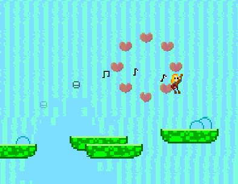
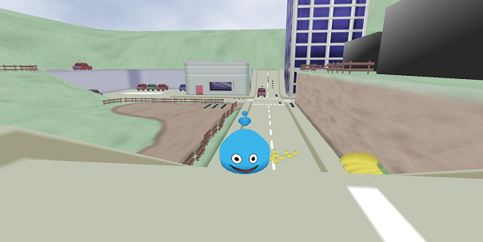

<header>
UVGD Project Gallery
=======
</header>
<main>
Games made by the UVic Game Development club, collected in one place for your viewing pleasure.

[back to main page](../index.html)

Friday Night Bullet Arena
-------------------------

A 4-player party game where you need to shoot down all the other players.
You only have one bullet, but you can catch it and shoot it again. Bullets also wrap around the screen.

Developed by Brandon Duncan.

[itch.io page](http://brandond.itch.io/friday-night-bullet-arena)

Auction Boxing
--------------

A smash bros-like fighting game with unique characters and abilities.
Before each fight, you participate in an auction where you are able to buy items for your fight.

Developed by Nick Pettyjohn and others (who?)

[github repository](https://github.com/NarPar/AuctionBoxing)

Good Hydrations
----------------

TODO: Description.

Developed by Nick Pettyjohn and others(who?)

[github repository](https://github.com/NarPar/Good-Hydrations)

Puppet Master
-------------

TODO: Description.

Developed by Nick Pettyjohn and others(who?)

[github repository](https://github.com/NarPar/PuppetMaster)

Rock n' Roll Soul
-----------------

A mix of platforming and physics based puzzle themed about love and rock and roll.

Developed by Brandon Duncan and Nicolas Guillemot (more credits on the github page.)

[github repository](https://github.com/nguillemot/LD22-Alone)

Credens Divinitatis
-------------------

An scrolling shooter made in 72 hours for the 2013 Tsukino-Con Game Jam.
The theme for the jam was Magical Girls.

Developed by Jason Lim.

TODO: Download link of some kind?

Slimageddon
-----------

A Katamari style game made in 72 hours during the UVIC GameDev Spring 2014 Game Jam.
Players control a small slime that absorbs objects in the world around it to get bigger.
Getting bigger allows the slime to absorb bigger objects and even buildings!

Developed by Jason Lim.

TODO: Download link of some kind?

</main>
